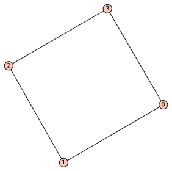
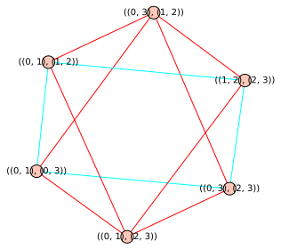

# Extend-Partial-Automorphism-to-Full-Automorphism

This package contains three functions:

# Uniform(G)

Input an arbitrary graph in the form:

'''python
 G=Graph([(0,2),(2,1),(1,3),(3,4),(4,2)])
 '''  
 
 It will output an uniform-degree-graph which have your original input G embedded in it. 
# G_X_n(G), 

Input an uniform-degree-graph. It will output a graph in G(X,n) form (a special type of intersection graph) with your original input G embedded. It will have its vertices as the edge set of you input graph. If you input a graph 

'''python
G=Graph([(0,1),(1,2),(2,3),(3,0)])
'''
which looks like:

With itself embedded in the output G(X,n) Graph (Blue is the orginal input):

# bijection(G,f1,f2,S),
Input G as a G(X,n) graph, f1 and f2 are two poor subgraphs of G, and S is the automorphosm between f1 and f2. Please make sure your input graph G has each of its vertex as the edge set of a uniform-degree graph. For example:

  '''python
Graph([(((0, 1), (0, 3)), ((0, 1), (1, 2))), (((0, 1), (0, 3)), ((0, 1), (2, 3))), (((0, 1), (0, 3)), ((0, 3), (1, 2))), \
    (((0, 1), (0, 3)), ((0, 3), (2, 3))), (((0, 1), (1, 2)), ((0, 1), (2, 3))), (((0, 1), (1, 2)), ((0, 3), (1, 2))), \
    (((0, 1), (1, 2)), ((1, 2), (2, 3))), (((0, 1), (2, 3)), ((0, 3), (2, 3))), (((0, 1), (2, 3)), ((1, 2), (2, 3))), \
    (((0, 3), (1, 2)), ((0, 3), (2, 3))), (((0, 3), (1, 2)), ((1, 2), (2, 3))), (((0, 3), (2, 3)), ((1, 2), (2, 3)))])
'''
To understant the mathematical terms used in this package, please refer to Milliet's paper "Extending partial ismorphisms of finite graphs" at (http://math.univ-lyon1.fr/~milliet/grapheanglais.pdf)
